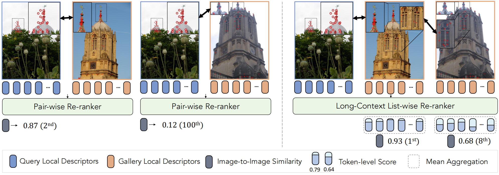
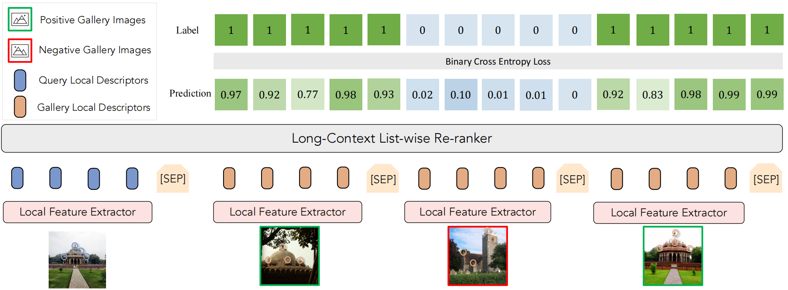
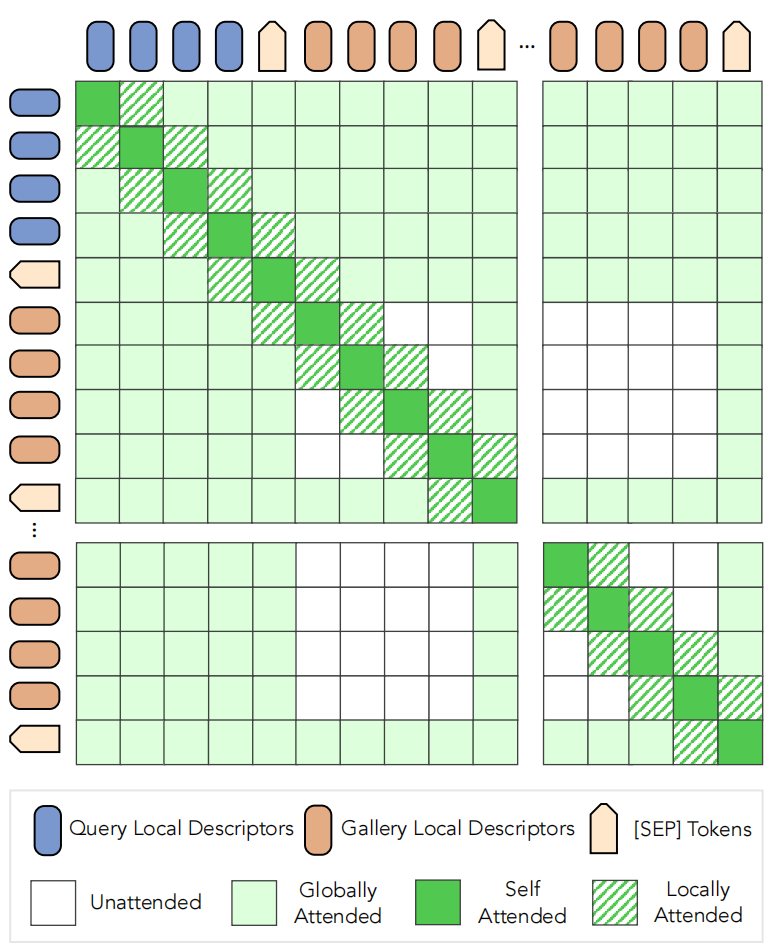
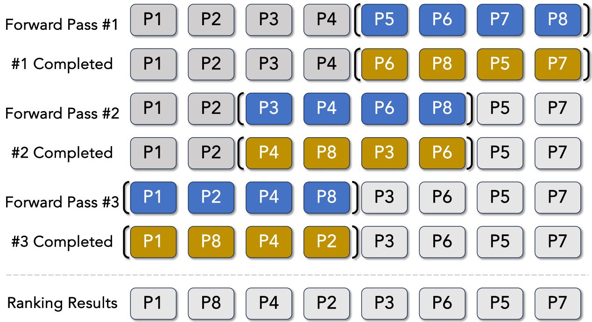
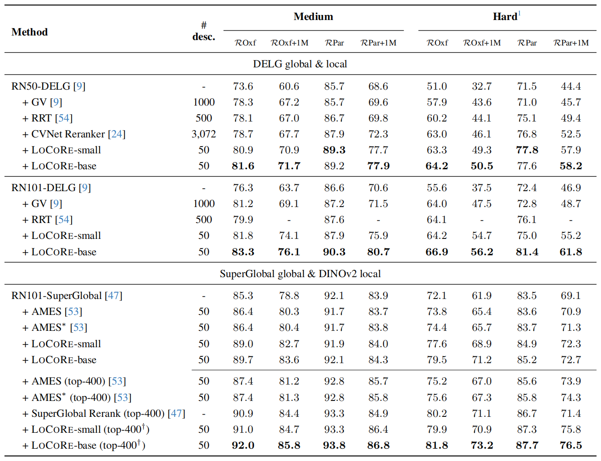
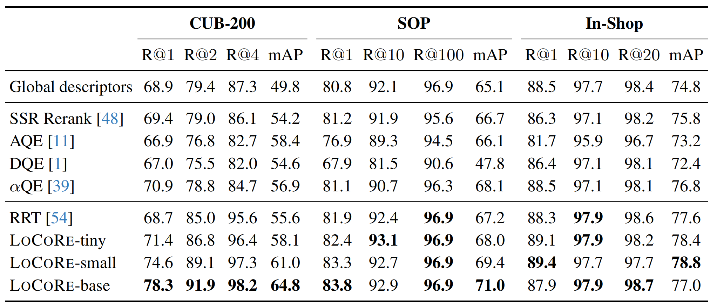
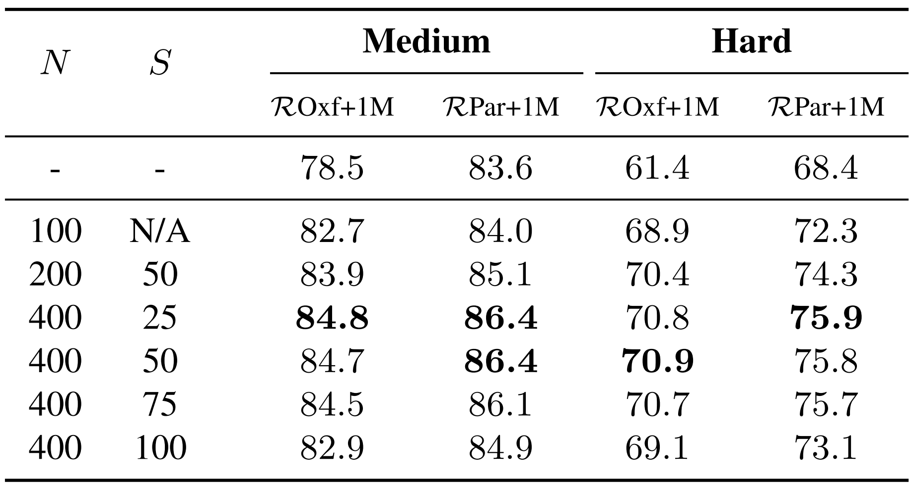
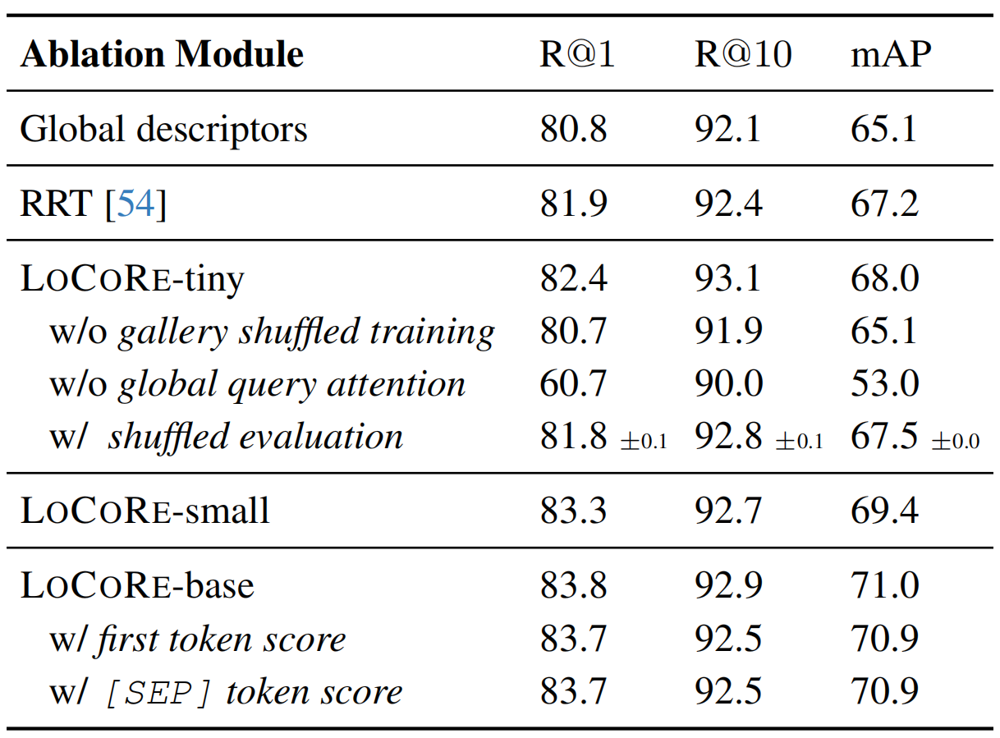
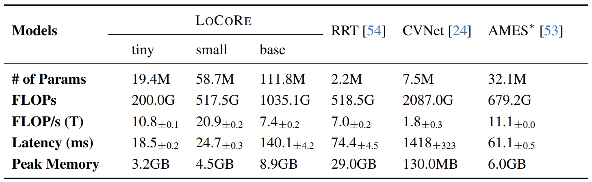

# RankCLIP

#### 论文主要方法总结

**LoCoRE（Long-Context Re-ranker）** 是一种用于图像检索的列表式重排序模型，其核心创新在于通过长上下文序列建模（Long-Context Sequence Modeling）联合处理查询图像和候选图像库（gallery）的局部描述符（local descriptors），从而优化相似性评分。

​	验证长上下文列表重排序（Long-Context List-wise Re-ranker）在跨模态图像检索任务中的有效性，特别是通过结合全局上下文信息优化图像对的全局匹配度，以解决传统逐对重排序（Pair-wise Re-ranker）仅依赖局部特征相似性导致的次优排序问题。

- **性能对比**: 传统逐对重排序依赖局部特征相似性（如Query与Gallery的Token级得分0.79 vs. 0.64），但最终图像对的全局相似性较低（例如某案例中仅排名第100位）。长上下文列表重排序通过整合序列上下文信息（如图中放大区域所示的建筑结构关联），显著提升全局相似性（如案例中从0.12提升至0.93，排名从第100位跃升至第1位）。
- **机制创新**：列表级重排序通过多图像对的上下文关联性建模（如“Mean Aggregation”操作），捕捉跨图像的全局语义一致性，克服了逐对方法的局部局限性。
- **实际效果**：实验表明，长上下文重排序能有效纠正逐对方法的排序偏差（如将高相似性图像对从低排名提升至首位），从而提升检索系统的整体准确性和鲁棒性。

----

#### 核心方法

- **长上下文建模**：将查询和候选图像的局部描述符拼接为长序列，利用基于Transformer的Longformer架构（线性复杂度）处理长序列依赖关系。
- **全局注意力机制**：为查询图像和分隔符（[SEP]）分配全局注意力，确保长距离依赖的捕捉（如图3所示）。
- **列表式训练**：通过打乱候选列表顺序（gallery shuffled training）避免模型依赖初始排序的偏差。

#### 算法创新点

- **首个列表式局部描述符重排序方法**：现有方法多为成对比较（如RRT、CVNet）或基于全局描述符的列表式重排序（如SSR），而LoCoRE首次在局部描述符层面实现列表式联合优化。
- **长上下文序列建模**：通过Longformer的滑动窗口注意力机制（图3）高效处理大规模候选列表（如100张图像），克服传统Transformer的上下文长度限制。
- **滑动窗口推理策略**：在测试时通过重叠滑动窗口（图4）扩展重排序范围，进一步提升性能。

---

#### 论文动机

-  **为什么使用该算法**

  - **问题局限性**：传统成对重排序（如几何验证GV、RRT）无法利用候选图像间的交互信息（例如重复出现的物体部件），导致相似性估计不准确。
  - **领域需求**：图像检索需要细粒度匹配（如遮挡、背景干扰），而局部描述符能提供更鲁棒的特征表示。

-  **该算法的作用**
  - **提升检索精度**：通过联合建模查询与候选图像的局部特征关系，显著改善难样本（Hard setting）的排名（如ROxf+1M数据集中mAP提升17.8点）。
  - **效率平衡**：单次前向传播完成多图像评分， latency接近成对方法（如RRT），但内存占用降低10倍（表5）。
  
- **相比其他算法的优越性**
  - **成对重排序（RRT/AMES）**：LoCoRE通过列表式上下文学习隐式校准候选排名，而成对方法独立处理每对图像，忽略全局信息。
  - **全局描述符重排序（SSR）**：局部描述符对遮挡和视角变化更鲁棒，适合细粒度任务（如CUB-200鸟类检索）。

---

#### 算法流程

- **序列构建**：拼接查询和候选图像的局部描述符，插入[SEP]标记和位置编码（图2）。
- **长上下文编码**：Longformer处理序列，结合局部滑动窗口注意力和全局查询注意力。
- **分类与聚合**：对每个描述符输出二分类分数，聚合（如[SEP]分数）得到图像级相似性。
- DELG局部描述符提取流程: 输入图像 → 多尺度缩放 → CNN特征提取 → 注意力权重计算 → top-L选择 → 局部描述符集合

##### 图2 基于长上下文的列表重排算法

- 算法流程

  - **特征提取**：使用Local Feature Extractor分别提取Query图像的局部描述子（Query Local Descriptors）和Gallery图像的局部描述子（Gallery Local Descriptors）。从图中可以看到，针对不同的Query和Gallery图像，都有对应的Local Feature Extractor进行特征提取操作。
  - **初步预测与损失计算**：将提取到的特征输入到模型中进行初步预测（Prediction），得到预测结果。同时，根据图像的标签（Label，1表示正样本，0表示负样本），计算Binary Cross Entropy Loss，用于衡量预测结果与真实标签之间的差异。
  - **长上下文列表重排**：将通过上述步骤得到的结果输入到Long - Context List - wise Re - ranker中，对Gallery图像的排序进行重新调整，以得到更优的结果。

- 算法设计原因和目的
  - **设计原因**：在图像检索等任务中，仅仅依靠初步的局部特征匹配和简单的预测可能无法得到准确且符合实际需求的排序结果。长上下文信息能够提供更多关于图像的细节和整体环境等信息，有助于更全面地评估图像之间的相似性和相关性。通过列表重排的方式，可以综合考虑这些因素，改善最终的检索效果。
  - **目的**：该算法旨在通过结合局部特征提取、初步预测以及长上下文的列表重排，提高图像检索等任务的准确性和可靠性。具体来说，就是要在大量的Gallery图像中更精准地找到与Query图像相关的正样本图像，并按照相关性从高到低进行排序，从而为用户提供更优质的检索结果 。

##### 图3 基于注意力机制的局部描述符处理算法

- 算法流程

  - **输入**：接收查询局部描述符（Query Local Descriptors）、图库局部描述符（Gallery Local Descriptors）以及[SEP] Tokens。
  - **注意力计算与标记**：计算全局注意力（Globally Attended），以浅绿色标记表示，即对所有输入描述符之间的全局关系进行关注和处理。计算自注意力（Self Attended），以深绿色标记表示，用于处理同一组内（查询或图库）描述符之间的关系。计算局部注意力（Locally Attended），以斜线绿色标记表示，聚焦于局部范围内的描述符关系。存在未关注（Unattended）部分，以白色标记表示，即这些位置在相应注意力计算中未被考虑。
  - **处理过程**：通过对不同类型注意力的计算和应用，对输入的描述符集合进行处理，可能用于特征匹配、检索等相关任务。

- 算法设计原因和目的
  - **设计原因**：在许多计算机视觉任务（如图像检索、匹配等）中，仅仅依靠全局信息可能会导致信息丢失或不准确的匹配结果。同时，局部的细节特征对于精确的识别和匹配也非常重要。因此，综合全局、自注意力和局部注意力的计算方式，可以更全面地捕捉描述符之间的关系。
  - **设计目的**：通过这种多维度注意力的处理方式，提高局部描述符处理的准确性和鲁棒性，从而提升相关计算机视觉任务（如特征匹配、图像检索等）的性能，使得模型能够更好地在不同场景下准确地找到对应的特征或图像。

##### 图4 基于多轮前向传递的排序算法

- 算法流程

  - **初始化**：设定初始的前向传递次数（如示例中的3次），准备待排序的元素集合（P1 - P8）。
  - **多轮前向传递**：在每一轮前向传递中，从元素集合中按顺序选取部分元素（例如第一轮选取P5 - P8），对这些元素进行排序处理或评估（图中通过蓝色框标注当前处理的元素组）。
  - **生成最终排序结果**：经过所有设定的前向传递轮次后，得到最终的元素排序结果（如示例中的P1、P8、P4、P2、P3、P6、P5、P7）。

- 算法设计原因和目的
  - **设计原因**
    - **逐步优化排序**：通过多轮前向传递，可以逐步对元素集合进行调整和优化。每一轮只处理部分元素，降低了一次性处理所有元素的复杂度，使得算法在处理大规模数据时更具可行性。
    - **考虑元素间的关系**：不同的前向传递轮次选取不同的元素组进行处理，可能是因为算法设计者认为不同元素之间存在特定的关系或影响，需要分批次进行处理和调整，以更好地反映元素之间的真实顺序或重要性。
  - **设计目的**：该算法的主要目的是对给定的元素集合进行排序，通过多轮前向传递的方式，以一种较为灵活和逐步优化的方式来生成最终的排序结果，期望得到一个更符合特定要求或更优的元素顺序，可能应用于信息检索、任务调度等相关领域中对元素顺序有要求的场景。

---

### 实验设置与结论

##### 表1 视觉描述符增强方法对比

- **实验目的**: 通过对比不同视觉描述符增强技术（如全局特征融合、重排序及描述符筛选）在多个数据集上的性能表现，验证**LoCoRE系列方法**在提升图像检索任务（Oxford和Paris数据集）中检索精度与效率的有效性。
- **实验结论**: 
  - **LoCoRE系列显著优于基线方法**：在DELG全局与局部特征框架下，LoCoRE-base和LoCoRE-small在Medium和Hard难度下均超越传统方法（如GV、RRT、CVNet Reranker）。例如，RN50-DELG+LoCoRe-base在Hard的RPar+1M任务中达到**58.2%**，较原方法提升16.6%。在SuperGlobal与DINOv2特征组合中，LoCoRe-base进一步提升性能，如RN101-SuperGlobal+LoCoRe-base在Hard的RPar+1M任务中达到**76.5%**，显著优于AMES等重排序方法。
  - **描述符筛选提升效率**：采用top-400筛选策略后，LoCoRe-base在SuperGlobal框架下性能进一步提升（如RN101-SuperGlobal+LoCoRe-base (top-400†)在Hard的RPar+1M任务中达**76.5%**），证明减少描述符数量可兼顾精度与计算效率。
  - **轻量化优势**：LoCoRe-small作为轻量版方法，其性能接近甚至超越部分复杂模型（如CVNet Reranker），且计算成本更低（如RN50-DELG+LoCoRe-small仅需50个描述符）。

##### 表2 不同方法在图像检索任务中的性能对比

- **实验目的**: 比较Global descriptors、各类重排序方法（如SSR Rerank、AQE等）以及LoCoRE不同规模模型在CUB - 200、SOP和In - Shop三个图像数据集上的图像检索性能，通过R@1、R@2、R@4、R@10、R@100、R@20以及mAP等指标衡量模型的检索准确性和效果。
- **实验结论**:
  - 在CUB - 200数据集上，LoCoRE - base模型在各项指标（R@1、R@2、R@4、mAP）上表现最优；在SOP数据集上，LoCoRE - base和LoCoRE - small在R@10和R@100指标上表现较好，且LoCoRE - base的mAP最高；在In - Shop数据集上，LoCoRE - base同样在多个指标上取得领先。
  - 相比Global descriptors、各类重排序方法，LoCoRE系列模型在三个数据集的大多数指标上都展现出更优的图像检索性能，说明LoCoRE模型在图像检索任务中具有较好的效果和应用潜力。

##### 表3 参数序列长度N与窗口长度S对模型性能影响

- 实验目的: 探究不同参数N（数量）和S（比例或设置等相关因素）在Medium和Hard两种难度下，对基于ROxf+1M和RPar+1M模型性能的影响
- 实验结论:
  - 在Medium难度下，当N = 400、S = 25时，模型在ROxf+1M和RPar+1M上分别取得84.8和86.4的较好成绩；整体来看，随着N从100增加到400，模型性能有提升趋势，但当S取值变化时，性能有一定波动。
  - 在Hard难度下，N = 400、S = 25时，模型在ROxf+1M和RPar+1M上分别取得70.8和75.9的成绩；同样，随着N增大性能有提升表现，S的不同取值也对性能有影响。无特定N和S设置时（“-”情况），模型在两种难度下性能相对较差 。表明合适的N和S取值有助于提升模型在难易不同场景下的性能。

##### 表4 消融模块对检索性能的影响

- **实验目的**: 通过逐步移除或修改LoCoRE模型的关键组件（如全局描述符、画廊洗牌训练、全局查询注意力等），分析各模块对图像检索任务中R@1、R@10和mAP指标的具体影响，验证其必要性与有效性。

- **实验结论**: 
  - **全局描述符与RRT的基线作用**：引入RRT（区域关系Transformer）较仅用全局描述符提升R@1（+1.1%）、R@10（+0.3%）和mAP（+2.1%），表明局部特征建模的重要性。
  - **LoCoRE-tiny的组件敏感性**：移除画廊洗牌训练仅轻微下降（R@1 -1.7%），但移除全局查询注意力导致显著性能衰减（R@1 -21.7%，mAP -12.1%），证明全局上下文建模是核心模块。采用洗牌评估时，性能略有提升（mAP +2.4%），说明模型对数据分布鲁棒性较强。
  - **模型容量与性能增益**：LoCoRE-small/base逐步增大参数量，mAP持续提升（68.0→71.0），验证更大模型能捕捉更复杂特征。
  - **首令牌与[SEP]令牌的等效性**：使用首令牌或[SEP]令牌计算相似度得分对性能无显著差异（mAP均为70.9），表明两种令牌选择在语义聚合上效果相当。

##### 表5 不同模型效率与资源占用对比

- 实验目的: 对比 LoCoRE（tiny/small/base）、RRT、CVNet、AMES* 等模型在参数量（# of Params）、计算量（FLOPs）、计算吞吐量（FLOP/s）、延迟（Latency）和峰值显存（Peak Memory）等维度的表现，评估各模型的效率与资源消耗特性。
- 实验结论:
  - **参数量**：LoCoRE 的参数量随模型尺寸（tiny→base）递增（19.4M→111.8M），但仍显著低于 RRT、CVNet；AMES* 参数量为 32.1M，介于 LoCoRE base 与 small 之间。
  - **计算量（FLOPs）**：LoCoRE base 达 1035.1G，在同类大模型中计算需求更高；RRT 计算量（518.5G）与 LoCoRE small（517.5G）接近；AMES* 以 679.2G 居中，CVNet 计算量最高（2087.0G）。
  - **计算吞吐量（FLOP/s）**：LoCoRE tiny（10.8T）和 small（20.9T）在轻量/中小型模型中表现突出；AMES*（11.1T）与 LoCoRE tiny 相当；RRT（7.0T）、CVNet（1.8T）和 LoCoRE base（7.4T）吞吐量较低。
  - **延迟（Latency）**：AMES* 延迟最低（61.1ms），适合实时性场景；LoCoRE tiny（18.5ms）、small（24.7ms）延迟较低；RRT（74.4ms）、LoCoRE base（140.1ms）和 CVNet（1418ms）延迟显著更高。
  - **峰值显存**：AMES* 仅 130.0MB，显存占用极低；LoCoRE tiny（3.2GB）、small（4.5GB）、base（8.9GB）随模型增大而增加；CVNet 显存需求异常高（29.0GB），推测与其计算流程或实现有关。

---

##### 参考文献

- LoCoRE论文地址(CVPR 2025): [CVPR Poster LOCORE: Image Re-ranking with Long-Context Sequence Modeling](https://cvpr.thecvf.com/virtual/2025/poster/34600)
