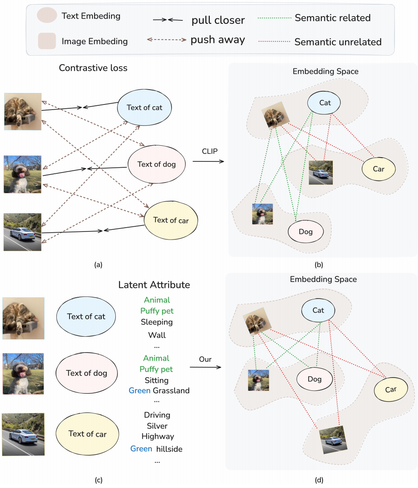
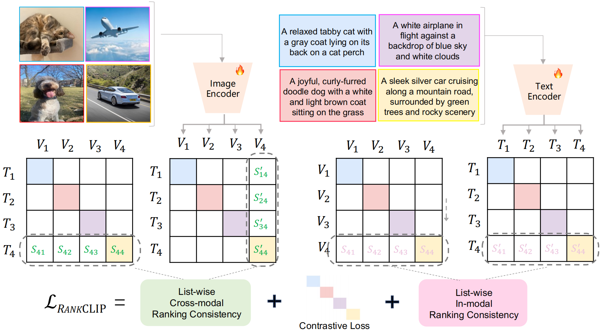
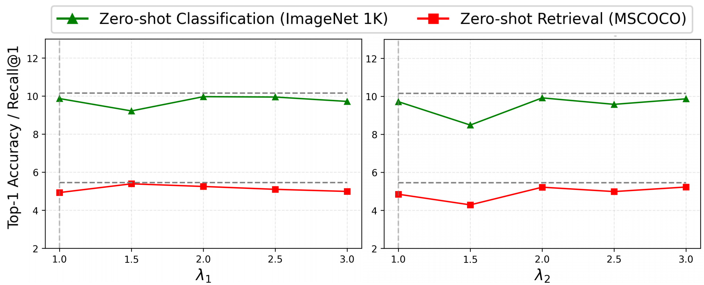
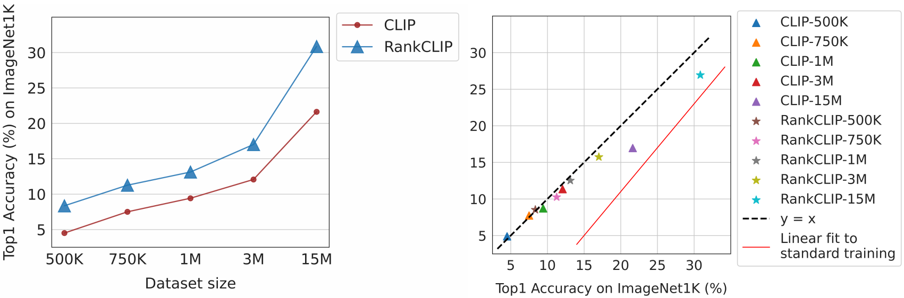
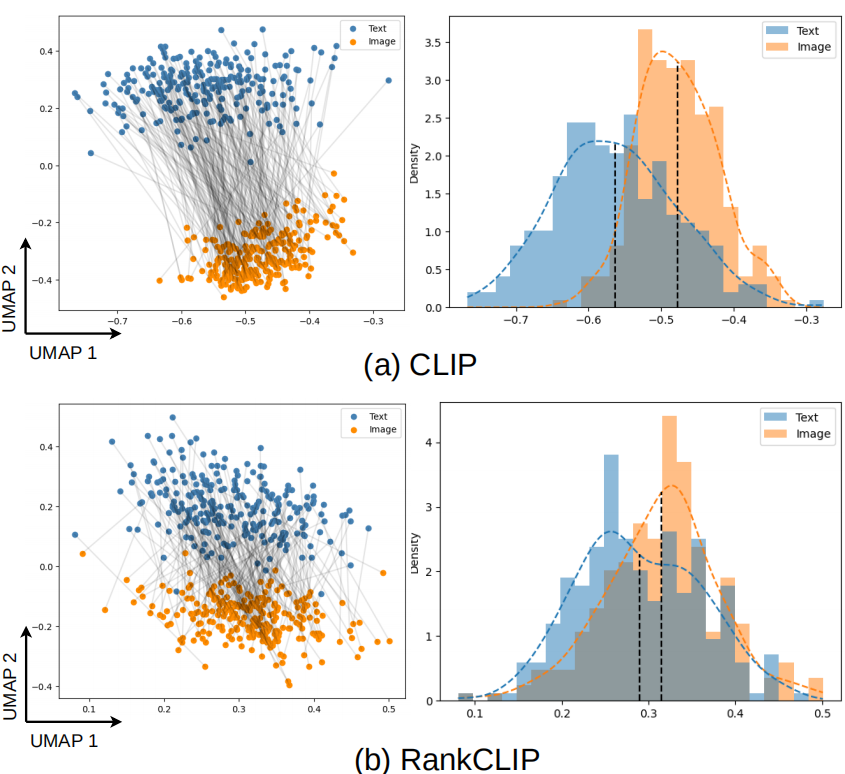
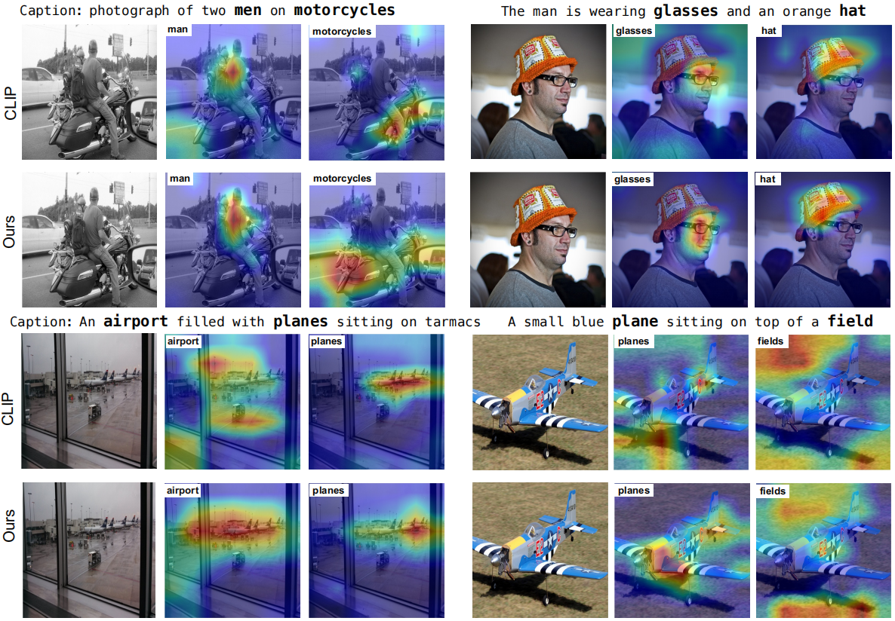
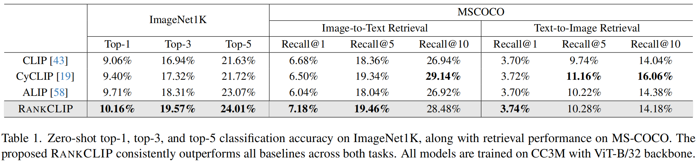
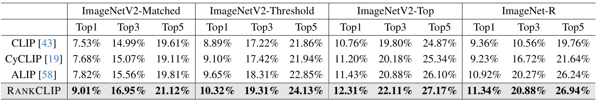
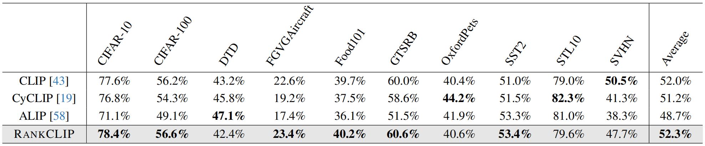
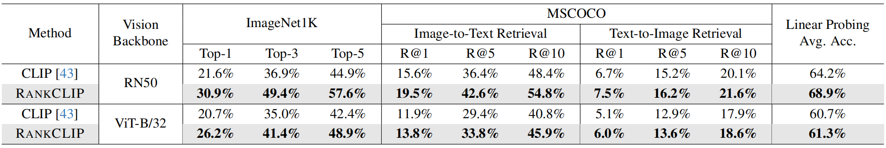

# RankCLIP

#### 论文主要方法总结

**RANKCLIP** 是一种基于**排名一致性（Ranking-Consistent）**的视觉-语言预训练方法，旨在改进传统的对比学习方法（如CLIP）中的**一对一匹配限制**。CLIP 通过对比损失（Contrastive Loss）优化图像-文本对的相似性，但忽略了**多对多关系**（如“狗”和“猫”在语义上比“狗”和“汽车”更接近）。RANKCLIP 提出了一种**列表式（List-wise）损失函数**，利用**跨模态（Cross-modal）和模态内（In-modal）的排名一致性**来捕捉更丰富的语义关系。

​	如上图展示了**对比学习（Contrastive Learning）**在**图文嵌入（Text-Image Embedding）**任务中的应用，特别是对比了两种方法：基于CLIP的方法和作者提出RankCLIP的方法。 我们可以将图分成几个部分来理解：

- **pull closer（拉近）**: 实线箭头，表示让两个嵌入向量的距离更近（在嵌入空间中靠近）。
- **push away（推远）**: 虚线箭头，表示让两个嵌入向量的距离更远（在嵌入空间中远离）。
- **Semantic related（语义相关）**: 绿色虚线，表示两个嵌入向量在语义上是相关的（例如，狗的图像和“狗”的文本）。
- **Semantic unrelated（语义无关）**: 红色虚线，表示两个嵌入向量在语义上是无关的（例如，狗的图像和“猫”的文本）。

​	CLIP依赖严格的**一对一对比学习**，仅优化正确匹配的图文对，将所有未匹配对视为同等负面样本。这忽略了真实数据中存在的复杂语义关系和图文间的潜在相关性。

​	RANKCLIP能够识别如"狗"与"猫"的语义相似性高于"狗"与"飞机"，即使它们都不是严格匹配对。这种**相对相似性感知**使模型学习更细粒度的语义结构。

----

#### 核心方法

- **Plackett-Luce (PL) 排名模型**：用于估计图像-文本对的排名概率分布，计算模态内和跨模态的余弦相似度（$S_{i,j}$）。
- **跨模态一致性排名（Cross-modal Consistency Ranking）**：确保图像与多个文本的相似性排名与文本与多个图像的排名一致。例如，狗的图片与“猫”文本的相似性应高于“飞机”文本，反之亦然。
- **模态内一致性排名（In-modal Consistency Ranking）**：确保相似图像（如狗和猫）对应的文本也相似。
- **动态权重调整**：在训练初期，排名一致性权重（λ1,λ2）逐步增加，避免早期优化不稳定。

RANKCLIP与训练损失函数为: 
$$
\mathcal{L}_{RANKCLIP}=\mathcal{L}_{CLIP}+\lambda_1\mathcal{L}_{cross}+\lambda_{2}\mathcal{L}_{in}
$$

#### 算法创新点

- **从一对一到多对多关系**：传统CLIP仅优化匹配对的相似性，而RANKCLIP利用未匹配对的**次级相似性**（如“狗”与“猫”的隐含关联）。
- **列表式优化**：不同于CLIP的成对（Pair-wise）损失，RANKCLIP通过全局排名优化整个批次（Batch）的相似性。
- **无需额外数据或模块**：仅需在损失函数中增加排名一致性项，即可提升性能。

---

#### 论文动机

-  **为什么使用该算法**

  - **现实数据中存在多对多关系**：例如，一张“狗”的图片可能与“宠物”“动物”等多个文本相关，而CLIP的严格一对一匹配无法捕捉这种复杂性。
  - **排名一致性可挖掘隐含信息**：通过优化未匹配对的相似性排名，模型能更高效地学习语义结构。

-  **该算法的作用**
  - **提升跨模态对齐**：通过排名一致性，模型能更好地理解图像和文本之间的细粒度关系。
  - **增强下游任务性能**：如零样本分类（Zero-shot Classification）和跨模态检索（Cross-modal Retrieval）。
  
- **相比其他算法的优越性**
  - **对比CLIP**：CLIP仅优化匹配对，忽略未匹配对的语义差异；RANKCLIP利用未匹配对的相对排序信息。
  - **对比CyCLIP（循环一致性）**：CyCLIP强调嵌入空间的几何约束，但仍是基于成对比较；RANKCLIP的列表级损失能全局优化批量内所有样本的排序。
  - **对比ALIP（合成标题增强）**：ALIP依赖外部数据生成，而RANKCLIP仅通过改进损失函数实现更高效的语义对齐。

---

#### 算法流程

- **输入**：一批图像-文本对 ${(V_i,T_j)}$。
- **编码**：分别通过图像编码器（如ViT）和文本编码器（如Transformer）生成嵌入向量 $v_i$和 $t_j$。
- **相似性计算**：
  - 跨模态相似性：$S_{i,j}=v_i\cdot t_j$（余弦相似度）。
  - 模态内相似性：图像-图像 $v_i\cdot v_j$，文本-文本 $t_i\cdot t_j$。
- **排名损失**：
  - 跨模态损失 $\mathcal{L}_{cross}$：最小化图像-文本排名与文本-图像排名的差异，即$\forall i,j$图文对$(v_i\cdot t_j,t_i,v_j)$基于第二元素进行排序后计算$\mathcal{L}_{cross}=-\log(\prod_{i,j}\frac{v_i\cdot t_j}{\sum_{k,l\land t_i\cdot v_j\geq t_k\cdot v_l}v_k\cdot t_l})$。
  - 模态内损失 $\mathcal{L}_{in}$：最小化图像-图像与文本-文本排名的差异, 即$\forall i,j$图图和文文对$(v_i\cdot v_j, t_i\cdot t_j)$基于第二元素进行排序后计算$\mathcal{L}_{in}=-\log(\prod\frac{v_i\cdot v_j}{\sum_{k,l\land t_i\cdot t_j\geq t_k\cdot t_l}v_k\cdot v_l})$。
- **动态权重调整**：$\lambda_1$,$\lambda_2$随训练轮次线性增加, 在本论文中$\lambda_1=\lambda_2=\text{clip}(\frac{3i-1}{n-1},0,2)$。

---

### 实验设置与结论

##### 图3 超参数对零样本任务的影响

- **实验目的**: 主要是为了探究超参数$\lambda_1$和 $\lambda_2$对模型在零样本分类（基于ImageNet 1K数据集）和零样本检索（基于MSCOCO数据集）任务上性能的影响。通过改变这两个超参数的值，观察模型的Top - 1准确率（针对零样本分类任务）和Recall@1（针对零样本检索任务）的变化情况，从而找到可能的最优超参数取值范围，以提升模型在这两个下游任务上的性能表现。
- **实验结论**: 从图中可以看出，超参数 $\lambda_1$和$\lambda_2$在各自的取值范围内，对模型在零样本分类和零样本检索任务上的性能影响均不强烈，模型在这两个任务上表现出一定的稳定性。然而，在$\lambda_1=1.5$和$\lambda_2=1.5$附近，两个任务的性能都出现了轻微的下滑，后续可以考虑避开这一取值区域进一步优化超参数，或者结合更多的实验来确定更优的超参数设置。

##### 图4 RankCLIP数据效率提升分析

- **实验目的**: 探究不同规模训练数据对CLIP与RankCLIP模型在ImageNet1K图像分类任务中Top1准确率的影响，重点验证RankCLIP是否具备更高的数据利用效率。
- **实验结论**:RankCLIP在数据效率和分类性能上均优于传统CLIP，为大规模视觉-语言预训练提供了更优的轻量化训练方案。
  - **数据效率优势**：RankCLIP在相同数据量下的Top1准确率显著高于标准CLIP（如15M数据时RankCLIP达约28%，CLIP仅约20%），且随数据量增长性能差距扩大，表明其在小样本场景下表现更优。
  - **线性拟合对比**：右侧散点图中，RankCLIP数据点（如RankCLIP-15M）明显偏离“$y=x$”基准线并贴近拟合线，说明其准确率提升速率超越标准训练的线性增长预期，进一步验证了RankCLIP通过对比学习优化特征表示的有效性。
  - **泛化能力增强**：RankCLIP的高效数据利用特性可能源于其引入的排序任务对语义关系的强化学习，使其在有限数据下仍能捕捉更细粒度的语义区分能力，从而提升跨数据集泛化表现。

##### 图6 CLIP与RankCLIP的文本图像特征分析

- 实验目的: 对比CLIP和RankCLIP两种模型在文本 - 图像特征映射上的表现，通过可视化和密度分布分析来观察文本和图像特征在低维空间（UMAP 1和UMAP 2维度）中的分布差异及匹配情况。
- 实验结论:
  - 从图6 (a) 可以看出，CLIP模型中文本特征（蓝色点）和图像特征（橙色点）在UMAP低维空间中有一定的聚集趋势，但两者之间的连接线表明特征对齐并不十分紧密。从密度分布图来看，文本和图像特征的密度分布峰值位置有所不同，说明CLIP模型下文本和图像特征的整体分布存在差异。
  - 对于RankCLIP模型（图6 (b)），文本特征和图像特征在UMAP低维空间中的分布相对更为分散，连接的线条显示特征对齐情况似乎比CLIP更差。在密度分布图中，文本和图像特征的密度分布形态和峰值位置也有所区别，且相比CLIP，其分布更为分散，表明RankCLIP模型在当前实验设置下，文本和图像特征的匹配效果可能不如CLIP模型理想 。总体而言，在该实验中CLIP在文本 - 图像特征匹配方面相对RankCLIP表现更优。

##### 图7 基于CLIP的图像语义定位对比实验

- **实验目的**: 对比CLIP方法和论文所提出的方法（Ours）在不同图像场景下对图像中特定语义对象（如人物、交通工具、物品等）的定位准确性，通过可视化热力图展示两种方法对各语义对象的关注区域差异。

- **实验结论**: 从热力图可视化结果来看，论文所提出的方法（Ours）在多个图像场景中对指定语义对象的定位更为精准，其热力图的高亮区域更贴合实际的语义对象位置；相比之下，CLIP方法在部分场景下对语义对象的定位存在偏差，高亮区域不够准确或集中。这表明所提出的方法在图像语义定位任务上可能具有更好的性能表现。

##### 表1 不同模型在图像检索任务表现对

- 实验目的: 比较CLIP、CyCLIP、ALIP和RANKCLIP等模型在ImageNet1K图像分类以及MS - COCO图像 - 文本双向检索任务上的性能表现。
- 实验结论: 所提出的RANKCLIP模型在ImageNet1K的top - 1、top - 3、top - 5分类准确率以及MS - COCO图像到文本和文本到图像检索的Recall指标上，均一致性地优于其他对比基准模型。所有模型均使用CC3M数据集进行训练，采用ViT - B/32骨干网络 。

##### 表2 RANKCLIP在多数据集的分类性能对比

- 实验目的: 比较不同视觉语言模型（如CLIP、CyCLIP、ALIP、RANKCLIP）在多个ImageNet衍生数据集（ImageNetV2-Matched、ImageNetV2-Threshold、ImageNetV2-Top、ImageNet-R）上的Top1、Top3、Top5分类准确率，评估各模型的性能表现。
- 实验结论: 在所有测试数据集及评价指标（Top1、Top3、Top5）上，RANKCLIP均取得了最高分类准确率, 相比基线模型（CLIP、CyCLIP、ALIP），RANKCLIP在复杂数据分布下的鲁棒性和泛化能力更优，验证了其在视觉-语言匹配任务中的有效性。

##### 表3 不同模型在多数据集性能对比

- 实验目的: 比较CLIP、CyCLIP、ALIP和RANKCLIP等模型在CIFAR - 10、CIFAR - 100、DTD、FGVGAircraft等多个不同数据集上的性能表现。
- 实验结论: 在各个数据集上，不同模型表现各有优劣。RANKCLIP在多个数据集（如CIFAR - 10、CIFAR - 100、Food101、SST2、SVHN等）上取得了相对较高的准确率，平均准确率为52.3%，在对比的模型中平均性能表现最优；CLIP平均准确率为52.0%；CyCLIP平均准确率为51.2% ；ALIP平均准确率为48.7% 。在个别数据集上，如CIFAR - 100上CyCLIP表现优于CLIP，DTD上ALIP表现优于CLIP和CyCLIP等，但综合来看RANKCLIP整体性能更突出。

##### 表4 RANKCLIP与CLIP性能对比实验

- 实验目的: 比较RANKCLIP和CLIP在不同视觉骨干网络（RN50、ViT - B/32）下，于ImageNet1K数据集的图像分类任务（Top - 1、Top - 3、Top - 5准确率），以及在MSCOCO数据集的图像 - 文本检索（R@1、R@5、R@10）和文本 - 图像检索（R@1、R@5、R@10）任务中的性能表现，并考察其在Linear Probing任务上的平均准确率。
- 实验结论: 在ImageNet1K数据集上，采用相同视觉骨干网络时，RANKCLIP的Top - 1、Top - 3、Top - 5准确率均高于CLIP；在MSCOCO数据集的图像 - 文本和文本 - 图像检索任务中，RANKCLIP的R@1、R@5、R@10指标也普遍优于CLIP；在线性探测任务中，RANKCLIP的平均准确率同样高于CLIP，表明RANKCLIP在这些任务上相对CLIP具有更优的性能。

---

##### 参考文献

- RankCLIP论文地址(ICCV 2025): [[2404.09387\] RankCLIP: Ranking-Consistent Language-Image Pretraining](https://arxiv.org/abs/2404.09387)

